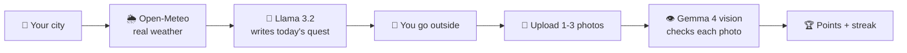

<div align="center">

# 🌿 Grass Quest

**A tiny daily side quest that sends you outside.**

Real weather → an AI-written outdoor mission → you go outside → an AI checks your photos → points and streaks.


</div>

<!-- Screenshots: add phone screenshots of the quest, the photo check and the streak here. -->

---

## 🤔 Why?

We all know we should "go touch grass." The hard part is having a reason to go. **Grass Quest gives you one small reason each day.** It's short, it's free, it's close to home, and it fits today's weather.

The app is built to keep your screen time low. You open it, read the mission, put the phone away and go. You only come back to upload a few photos.

## ✨ Features

- 🌦️ **Weather-aware missions.** The app checks the real weather for your city (temperature, rain chance, wind, sunrise and sunset). On a rainy day you get a short, safe mission, not a two-hour hike.
- 🧭 **A new quest every day.** Llama 3.2 writes a mission with a title, steps, the best time to go and a safety tip. It doesn't repeat your recent missions.
- 📸 **AI photo check.** Upload 1 to 3 photos. A vision model describes what it sees, decides if the photo matches the mission, and gives points out of 10.
- 🚫 **Hard to cheat.** A photo of your keyboard gets 0 points. Indoor photos can get at most 2 points.
- 🔥 **Points and daily streaks.** Complete a quest on back-to-back days to grow your streak.
- 📱 **Works on your phone.** Run it on your laptop and open it on your phone on the same WiFi. You can upload photos straight from the camera.
- 🔑 **No API keys.** The weather comes from [Open-Meteo](https://open-meteo.com), which is free and open.

## ⚙️ How it works



| Step | What happens | Powered by |
|---|---|---|
| 1 | You type your city once | Open-Meteo geocoding |
| 2 | The app gets today's weather | Open-Meteo forecast |
| 3 | An AI writes a 15-45 minute outdoor mission | **Llama 3.2**, running locally |
| 4 | You go outside and take photos | You 🌳 |
| 5 | An AI looks at each photo and scores it out of 10 | **Gemma 4** on Ollama Cloud, or a local vision model |
| 6 | Your points and streak are saved | A local JSON file |

## 🚀 Quick start

**You need:** Python 3.10+, [Ollama](https://ollama.com/download) and a free Ollama account.

```bash
# 1. Get the models
ollama pull llama3.2
ollama signin                  # free account, for the cloud vision model
ollama pull gemma4:31b-cloud

# 2. Get the code
git clone https://github.com/VIKRAM-009/grass-quest.git
cd grass-quest
pip install flask pillow

# 3. Run it
python3 app.py
```

Then open:

- 💻 On the laptop: **http://localhost:5000**
- 📱 On your phone (same WiFi): **http://&lt;your-laptop-ip&gt;:5000**

> 💡 To find your laptop's IP address, run `hostname -I` on Linux or `ipconfig getifaddr en0` on macOS.

## 🔌 Fully offline mode

Want nothing to leave your laptop? Use a local vision model instead of the cloud one:

```bash
ollama pull qwen2.5vl:3b
VISION_MODEL=qwen2.5vl:3b python3 app.py
```

> ⚠️ The local vision model needs about **10 GB of free RAM**, and each photo takes about **45 seconds** to check on a CPU. Close heavy apps (like browsers with many tabs) before you start.

## 🎛️ Configuration

Swap in any Ollama model with environment variables:

| Variable | Default | What it does |
|---|---|---|
| `TEXT_MODEL` | `llama3.2` | Writes the daily quest |
| `VISION_MODEL` | `gemma4:31b-cloud` | Checks your photos (it must support images) |

```bash
TEXT_MODEL=qwen2.5 VISION_MODEL=gemma3:4b python3 app.py
```

## 🔒 Privacy

| Data | Where it goes |
|---|---|
| Your city | Sent to Open-Meteo to get the weather |
| Your quests, points and streak | Stay on your machine in `quest_data.json` (ignored by git) |
| Your photos | Sent to Ollama Cloud by default so Gemma 4 can check them. In [offline mode](#-fully-offline-mode), they never leave your laptop. |

The quest writer is told never to ask for photos of people's faces or private property.

## 🌍 Why open models?

Every AI part of Grass Quest is an **open-weight** model: Llama 3.2, Gemma 4 and Qwen2.5-VL. This means:

- **You choose where it runs.** Use your own laptop, the cloud, or a mix.
- **No lock-in.** Swap models with one environment variable.
- **It's free to run.** There are no paid API keys and no subscriptions.
- **Anyone can fork it.** Make a version for your city, your school or your running club.

## 🧱 Tech stack

- **Backend:** Python, Flask (one file: `app.py`)
- **AI:** Ollama with Llama 3.2 (text), and Gemma 4 or Qwen2.5-VL (vision)
- **Data:** the Open-Meteo weather and geocoding APIs
- **Images:** Pillow (it shrinks phone photos before they are checked)

## 🎃 Built for Hacktoberfest 2026

Made for the **Hacktoberfest 2026 DEV Challenge, Week 1: "Touch Grass"** by [@VIKRAM-009](https://github.com/VIKRAM-009).

<div align="center">

**Now close this tab and go outside. 🌱**

</div>
